# In progress
---

# Split keyboard IsThisLoss 

Welcome to the IsThisLoss repository. In this README you will find my knowledge about split keyboards, usefull materials to learn from, my steps of building this keyboard, tools I used etc. Hope that will help someone, same as mamy other usefull sources helped me.

## Table of Contents

- [Project Overview](#project-overview)
- [Usefull Recourses and Tools](#usefull-resources-and-tools)
- [Keyboard Design](#keyboard-design)
- [Tips & Tricks](#tips--tricks)

---

## Project Overview

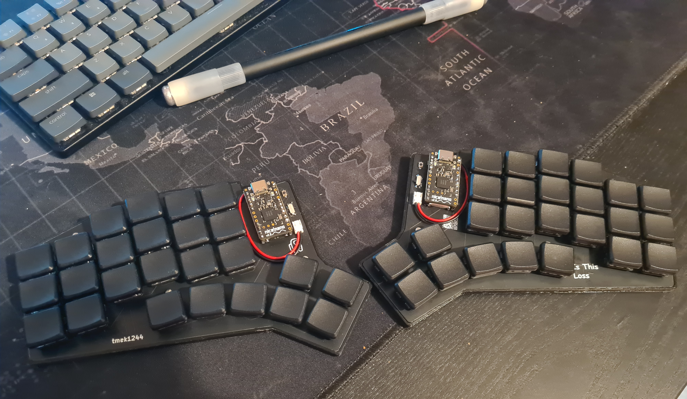

This project is a documentation of my journey in creating a custom split keyboard. It encompasses every stage of the process, from the initial design concept to the final product. Whether you're a fellow keyboard enthusiast or just curious about the DIY keyboard-making world, this repository is meant to inspire, educate, and entertain.

## Usefull Recourses and Tools

### Youtube videos
Here are three great videos from [Ben Vallack](https://www.youtube.com/@BenVallack/videos):
- About [Ferris Sweep Compact](https://www.youtube.com/watch?v=JqpBKuEVinw&ab_channel=BenVallack) - process of ordering, customising and building that keyboard
- [Designing your custom keyboard](https://www.youtube.com/watch?v=UKfeJrRIcxw&ab_channel=BenVallack)
- [Designing your custom keyboard in depth](https://www.youtube.com/watch?v=M_VuXVErD6E&ab_channel=BenVallack)
Here is a video about KiCad, rather long tho (1:40) and its probably not necessary, but in case your would like to learn more about this powerfull tool
- [Designing STM32 PCB](https://www.youtube.com/watch?v=aVUqaB0IMh4&ab_channel=Phil%E2%80%99sLab) - KiCad tutorial

### Articles
- [FlatFootFox](https://flatfootfox.com/) - you can find there 6 articles about designing your custom keyboard with Ergogen v4. It starts from [introduction](https://flatfootfox.com/ergogen-introduction/). 
- [Kyria rev3](https://docs.splitkb.com/hc/en-us/sections/6269738440220-Aurora-Kyria-rev3-Build-Guide) - build guide, I was able to better understand building process by reading this article
- [How key matrices works](https://pcbheaven.com/wikipages/How_Key_Matrices_Works/)

### Ergopad
[Tool](https://pashutk.com/ergopad/) allowing you to try and see how your fingers moves and which layout would be the most suitable for you. Quite interesting tool, but after all I haven't used it.

### Ergogen
Open source project on [github](https://github.com/ergogen/ergogen). It provides a common configuration format to describe 2D layout and generate plates, cases and un-routed PCBs. You can clone this repo (which will be usefull at some point) or play with online version. 
There are two available versions [ergogen.xyz](https://ergogen.xyz/) and [ergogen.cache.works](https://ergogen.cache.works/), but I recommend the latter as it shows in real time how would your keyboard looks like. 

### KiCad
KiCad is a free software suite for electronic design automation. It facilitates the design and simulation of electronic hardware. It features an integrated environment for schematic capture, PCB layout, manufacturing file viewing, ngspice-provided SPICE simulation, and engineering calculation.
I found this tool pretty intuitive and if you want to just desing keyboard you really don't need to know much about this software (Ergogen will genereate most of that for you).

### ZMK
[ZMK](https://zmk.dev/) is open source keyboard firmware focused on wireless and battery-powered keyboards. Other popular option for a firmware is [QMK](https://qmk.fm/) but it doesn't support wireless keyboards. Because I wanted to have cleaner setup I went with the former.
You can find my config z[here](https://github.com/tmek1244/zmk-config).

## Keyboard Design
### Intro
I knew which layout looks the best for me - [Kyria rev3](https://splitkb.com/collections/keyboard-kits/products/kyria-rev3-pcb-kit). It has 50 keys which is a lot compared to many other split keyboards ([one key keyboard](https://www.youtube.com/watch?v=vr8LkjsRqZs&ab_channel=BenVallack)), but I didn't want to make it too compact.

### Start with Erogopad
Go checkout [Ergopad](https://pashutk.com/ergopad/), it didn't work for me, but might work for you. Having a tablet would be an advantageous as you will be tapping on screen.

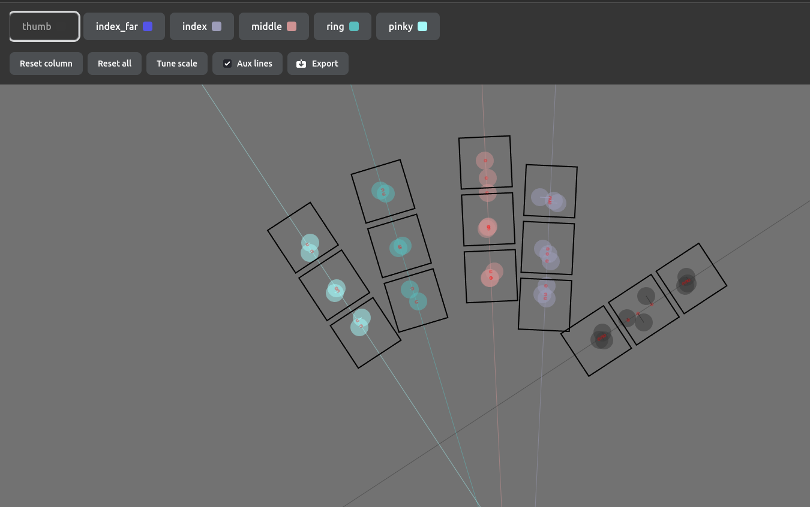

### Create design in Ergogen
I had a lot of struggles with writing anything in Ergogen, until I found a tutorial about new at that time version 4 from FlatFootFox. I encourage you to go check that out. 
Important thing to metion, I only desinged one side (and probably you should too) because get the other one for free! You just put this piece on the other side. This has its consequences, namely the pins on the other side will be reversed. That means that you would have to put microcontroller on the other side too. I didn't like that much so I use footprint suggested by Ben Vallack in one of his tutorials - [promicro pretty](/ergogen/src/footprints/promicro_pretty.js). 
The config is written in yaml, if you're using [ergogen.cache.works](https://ergogen.cache.works/) you can see your progress in real time, which is realy cool. Using Ergogen you can create pcb layout (which is the main advantage), but other staff like creating cases or plates are also great.

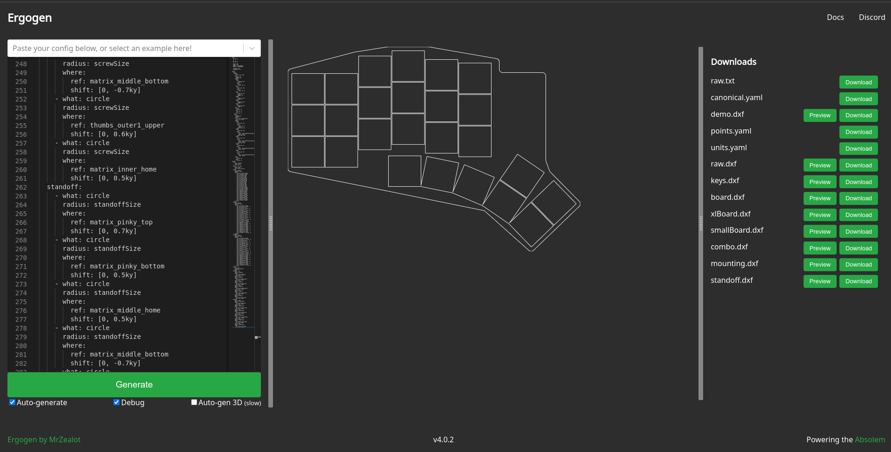

After I though I have a good desing I generated `kicad_pcb` file (by clicking Generate on website or running `ergogen input.yaml -o output_folder` in CLI - you have pcb block in your config - [read more](https://docs.ergogen.xyz/pcbs)) and opened it in KiCad. 

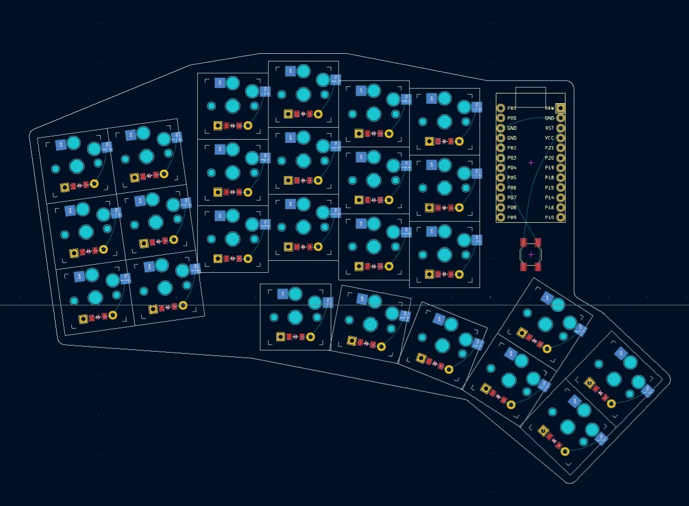

Next I printed out my mockups on piece of paper, stick it to the cardboard and put switches in. This way I was able to actually feel how it's gonna be typing on this keyboard.   

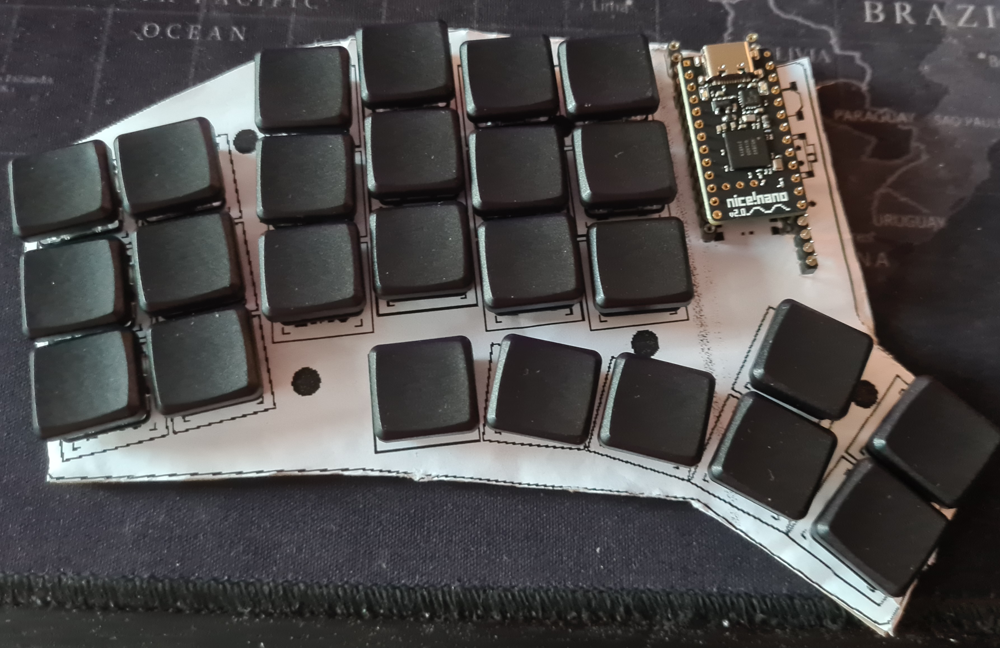
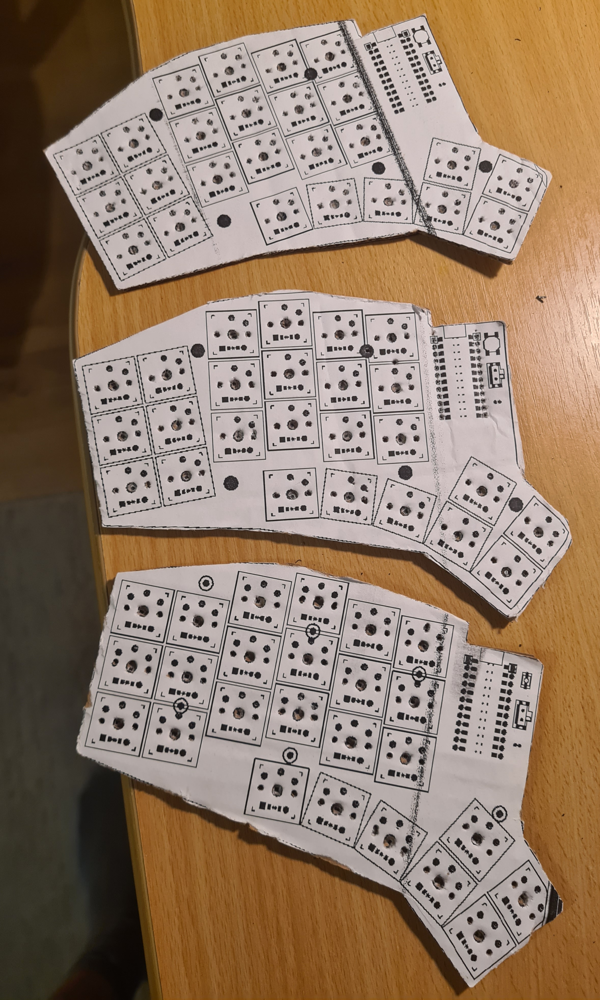

### Finish PCB design

After iterating over 3 designs and choosing the best one (the standard one lol), I begin with creating actuall PCB desing. I had to switch to [CLI Ergogen](https://github.com/ergogen/ergogen) tool. I used a few new footprints, which I found in Ben Vallack [repository](https://github.com/benvallack/ergogen). In some of them I had to change a few things, as his config was written in Ergogen v3. You can find all these footprints in [/ergogen/src/footprints/](/ergogen/src/footprints/) as well as the final config [/ergogen/config.yaml](/ergogen/config.yaml). 

The final PCB looks like this:

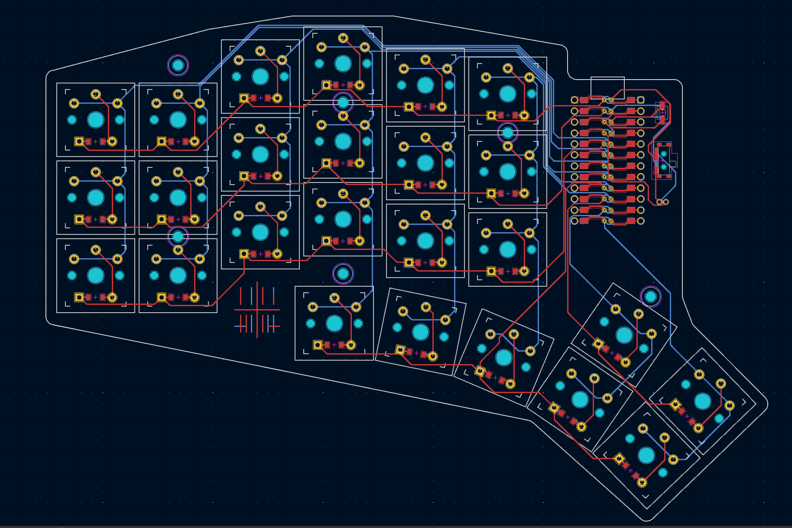

I would really suggest to make sure that all wires are connect properly, go thorogh each connection, try to understand why it is there and so on. For me the boards costed €32.52 what in combination with the shipping time (above one week) made me really want to make sure that everything is correct. 
You can find my final PCB desing [here](/final_pcb/pcbs/keyboard.kicad_pcb) alongside with all files that Erogogen generated.

### Printing the case

When I was waiting for PCBs to arrive I bought all other necessary parts like buttons, diodes etc. You can find all parts I used in [Parts](#parts).
I also printed the case (I changed the design a little bit using Blender - one wall was to thin and I didn't want to spend more time trying to move it in Ergogen). 

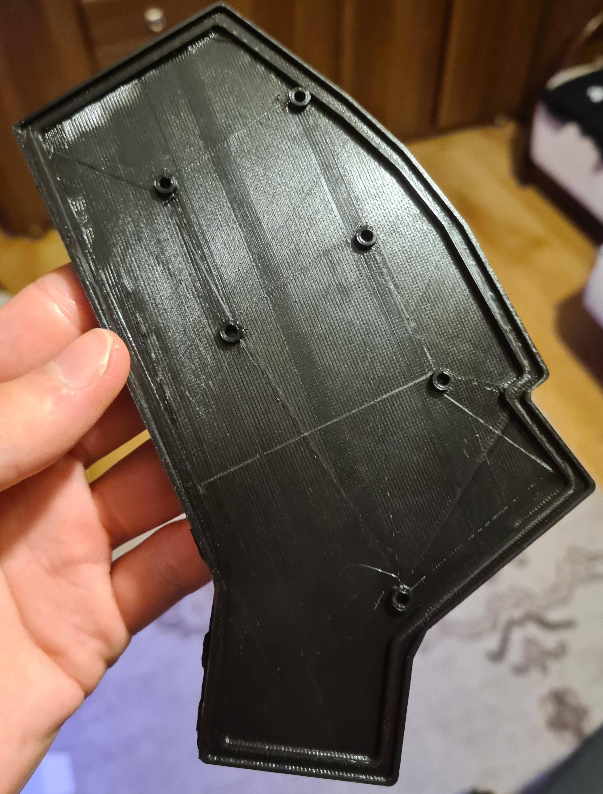
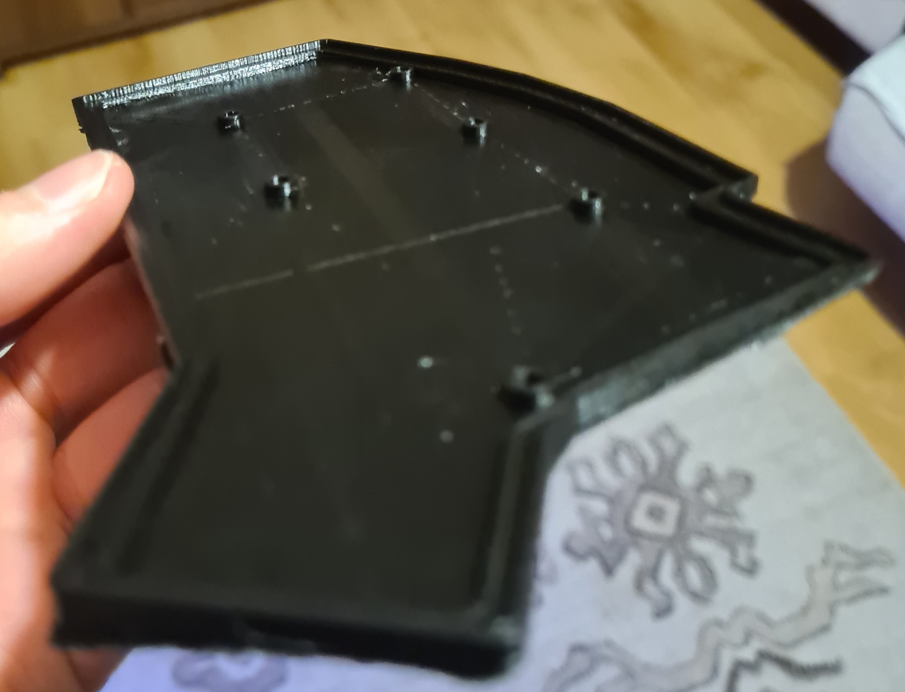

### Assembly

The PCBs looks really good! I was really happy with the result.

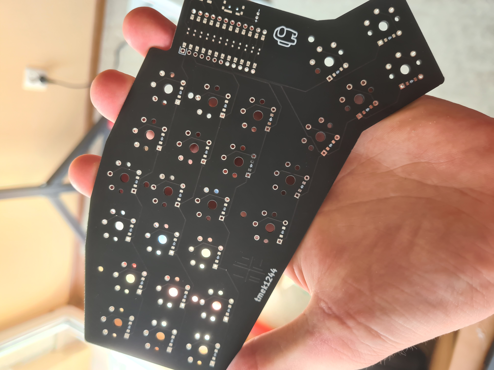
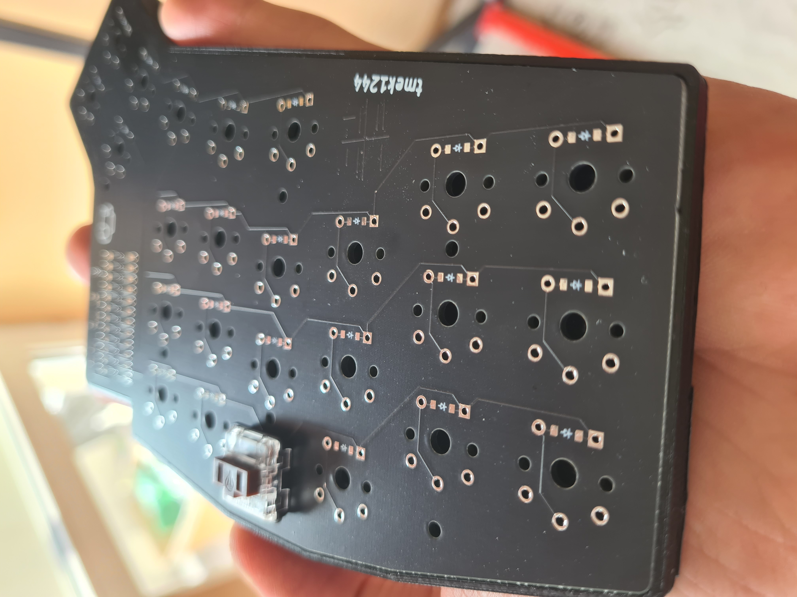

One thing to mention, I messed up the possition of the Amongus :/ because battery wire is right above him.

When I got all the elements, I was able to finally put it toghether. 
- I started with soldering diodes (and checking every connection with multimeter).
- Then I put 3 screws per part, because I wouldn't be able to put them when switches would be soldered.
- Next I put switches in and soldered them. 
- After that I soldered microcontroller and all other elements. Nice!Nano comes without soldered pins and I didn't buy the recommended one the Mill Max as they are pretty pricey. I saw that many people use THT diodes (or other resistors) legs, but they seemed too soft for me. I found this [repo](https://github.com/joric/nrfmicro/wiki/Sockets/acb60b52e944bf0ea39e4a0f4e1fb88a0c9fdea8) where I get what I wanted. The solution was to use the male to male connectors often found in RGB led strips. Just get a good pliers.
- Last but not least I change battery connectors to JST.

After assembling the keyboards it was time to get familiar with ZMK.

### ZMK

You can check out my [current config](https://github.com/tmek1244/zmk-config). There are lots of options there, so I highly recommend to go checkout the [documentation](https://zmk.dev/). ZMK allows creating layers, which are basically different keymaps. You can switch between them using key combination. 
The most important behaviors are:
- `&kp A`- the "key press" behaviour sends standard keycodes on press/release
- `&mt LSHIFT A` - the "mod-tap" behaviour sends modifier keycode if pressed longer than 200ms, otherwise sends tap keycode
- `&mo LOWER` - the "momentary layer" behavior enables a layer while a certain key is pressed
- `&sl LOWER` - the "sticky layer" behavior enables a layer until a certain key is pressed again. I use sticky layer for activating layer with f keys.

The mod-tap behaviour is simpler version of [hold-tap](https://zmk.dev/docs/behaviors/hold-tap) which might be useful in home modifiers.

You can build firmware locally, although I spend quite some time trying to do that and I wasn't able to. I end up using [Github Actions](https://zmk.dev/docs/user-setup). You simply upload firmware to nice!nano by connecting it to your computer and double pressing reset button. Then you can just drag and drop file to the device.

## Parts
- 5x PCB (you cannot order less, but you will use two of them)
- 2x [Nice!Nano](https://nicekeyboards.com/nice-nano/)
- 48x machine sockets
- 48x machine pins
- 50x Kalih Low Profile Choc Switches (although I think that linear switches might be better - didn't tested tho)
- 48x Blank MBK Choc Low Profile Keycaps
- 2x Blank MBK Choc Low Profile Keycaps with homing bumps
- 50x SMD diodes (1N4148W)
- 2x 3.7V 110mAh LiPo battery (L401230)
- 2x ZHR-2 JST female connector (you can also solder battery directly to the board)
- 2x S2B-ZR(LF)(SN) JST male connector (also optional)
- 2x slide switches (PCM12SMTR)
- 2x buttons (B3U-1000PM)
- 12x M2x4mm screws 
- 12x threaded inserts M2x3x3.5mm for the case

## Tips & Tricks - Summary
- if you want to avoid mounting diodes you have to reduce the number of keys to number of pins available on your microcontroler (for Nice!Nano is it 17). It has to know which key was pressed and you couldn't tell it if there was a multiple keys connected to one pin right.
And that's where key matrices are used (you can read more [here](https://pcbheaven.com/wikipages/How_Key_Matrices_Works/)). It turned out being pretty easy to understand and use. Routing was a little be trickier but that's about that.
Also you may think that soldering such small parts as SMD diodes would be hard, but that's also not the case! Although you have to have a good pair of tweezers. 
- use pins from rgb led connectors
